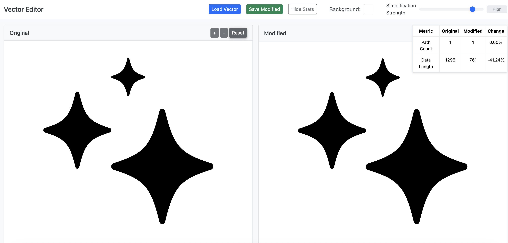

# Vector Editor

This tool is also available online at [https://oriolff.github.io/Vector-simplifier/](https://oriolff.github.io/Vector-simplifier/)

This tool is designed to simplify SVG and Android Vector Drawable files, primarily to reduce path data complexity and avoid lint warnings associated with long path strings in Android development.

## Project Goal

The main objective of this project is to provide a simple, visual tool to:
1.  **Simplify SVG Paths**: Reduce the number of points and commands in SVG path data using the SVGO library.
2.  **Avoid Lint Warnings**: Specifically targets the `VectorPath` lint warning in Android Studio, which flags overly complex vector drawables.
3.  **Visualize Changes**: Offer a side-by-side comparison of the original and simplified vector to immediately see the impact of the simplification.

## Dependencies

This project relies on the following external libraries:

### 1. SVGO (SVG Optimizer)
-   **Purpose**: The core engine for SVG simplification. It processes the SVG content and applies various optimizations, including path data simplification, to reduce file size and complexity.
-   **Repository**: [https://github.com/svg/svgo](https://github.com/svg/svgo)

### 2. Material Style
-   **Purpose**: A lightweight CSS framework used for the user interface components like buttons, sliders, and modals to provide a clean, modern look and feel.
-   **Repository**: [https://github.com/materialstyle/materialstyle](https://github.com/materialstyle/materialstyle)

## How to Use the App

1.  **Start a Local Server**: This application is a static website and needs to be served by a local HTTP server. You can start one easily from the project directory using Python:
    ```bash
    python3 -m http.server
    ```

2.  **Open the App**: Open your web browser and navigate to `http://localhost:8000` (or the port your server is running on).

3.  **Load a File**: Click the **Load File** button to select an `.svg` or `.xml` (for Android Vector Drawable) file from your computer.

4.  **Simplify the Vector**: Use the **Simplification Tolerance** slider to adjust the precision of the SVG path data. A higher tolerance results in a simpler (but less accurate) vector. The right-hand preview will update in real-time.

5.  **Inspect the Previews**:
    -   The left panel shows the original, untouched vector.
    -   The right panel shows the simplified version.
    -   Use the **Zoom In**, **Zoom Out**, and **Reset Zoom** buttons or your mouse wheel to inspect the details. You can also pan the image by clicking and dragging.

6.  **View Statistics**: Click the **Toggle Stats** button to see statistics about the original and modified files, including file size and path command counts.

7.  **Download the Result**: Once you are satisfied with the simplification, click the **Download** button to save the modified vector as a new `.svg` file.

## Screenshots


